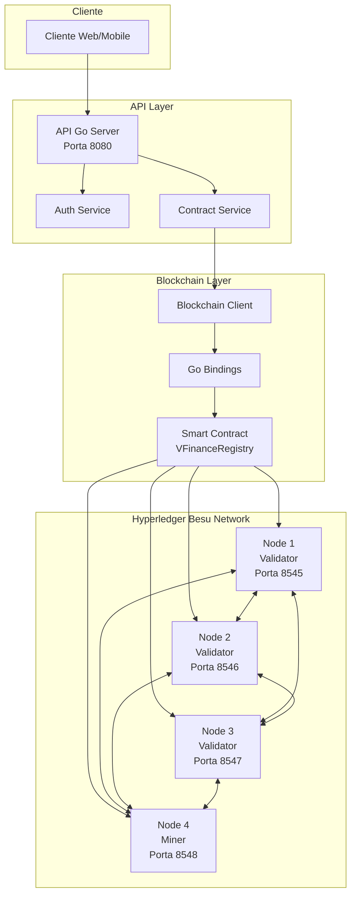
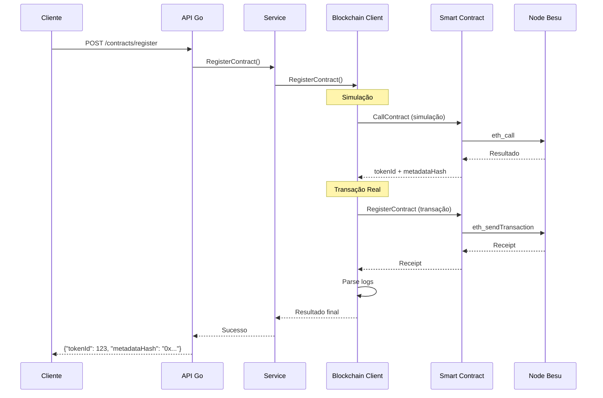
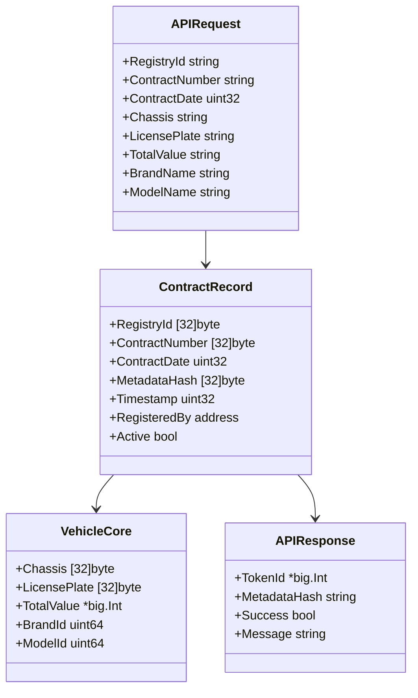
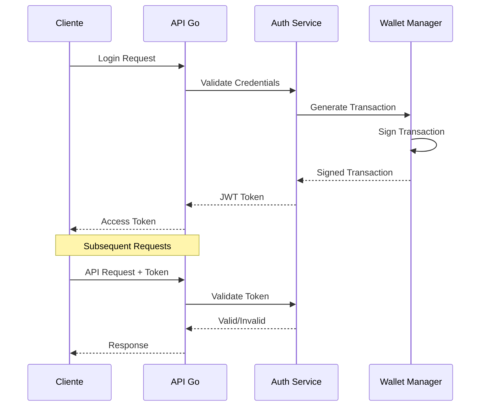
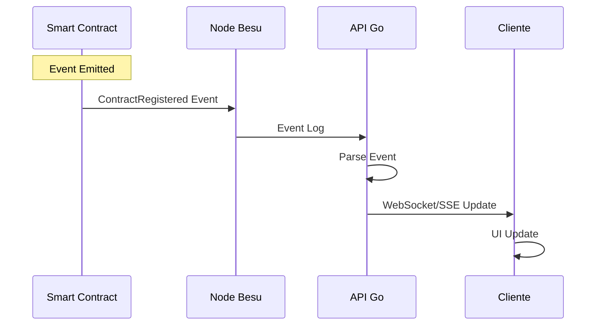
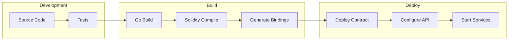

# 🏗️ Diagramas de Arquitetura - Sistema VFinance

## 🌐 Arquitetura da Rede Blockchain



## 🔄 Fluxo de Registro de Contrato



## 📊 Estrutura de Dados



## 🔐 Fluxo de Autenticação



## 📝 Eventos da Blockchain



## 🚀 Deploy Pipeline



## 📋 Configuração dos Nodes

### Node 1 (Validator)
```bash
besu --data-path=/data/node1 \
     --genesis-file=/config/genesis.json \
     --p2p-port=30303 \
     --rpc-http-port=8545 \
     --miner-enabled=false
```

### Node 2 (Validator)
```bash
besu --data-path=/data/node2 \
     --genesis-file=/config/genesis.json \
     --p2p-port=30304 \
     --rpc-http-port=8546 \
     --miner-enabled=false
```

### Node 3 (Validator)
```bash
besu --data-path=/data/node3 \
     --genesis-file=/config/genesis.json \
     --p2p-port=30305 \
     --rpc-http-port=8547 \
     --miner-enabled=false
```

### Node 4 (Miner)
```bash
besu --data-path=/data/node4 \
     --genesis-file=/config/genesis.json \
     --p2p-port=30306 \
     --rpc-http-port=8548 \
     --miner-enabled=true
```

## 🔧 Endpoints da API

| Método | Endpoint | Descrição |
|--------|----------|------------|
| POST | `/api/v1/contracts/register` | Registra contrato |
| GET | `/api/v1/contracts/hash/{hash}` | Busca por hash |
| GET | `/api/v1/contracts/exists/{hash}` | Verifica existência |
| PUT | `/api/v1/contracts/{id}/status` | Atualiza status |
| PUT | `/api/v1/contracts/{id}/metadata` | Atualiza metadata |
| POST | `/api/v1/brands` | Registra marca |
| POST | `/api/v1/models` | Registra modelo |

## 📊 Métricas de Monitoramento

- **Block Height**: Altura atual da blockchain
- **Peer Count**: Nós conectados
- **Transaction Pool**: Transações pendentes
- **Gas Used**: Gás consumido por bloco
- **API Response Time**: Tempo de resposta da API
- **Error Rate**: Taxa de erros
- **Active Connections**: Conexões ativas


