# 📋 Diagramas de Sequência - Sistema VFinance

## 🏗️ Arquitetura Geral

O sistema VFinance é composto por:
- **API Go** (`/api`) - Backend da aplicação
- **Smart Contract Solidity** (`/solidity`) - Contrato inteligente na blockchain
- **4 Nodes Hyperledger Besu** - Rede blockchain privada

## 🔄 Fluxo Principal: Registro de Contrato

### 1. Inicialização do Sistema

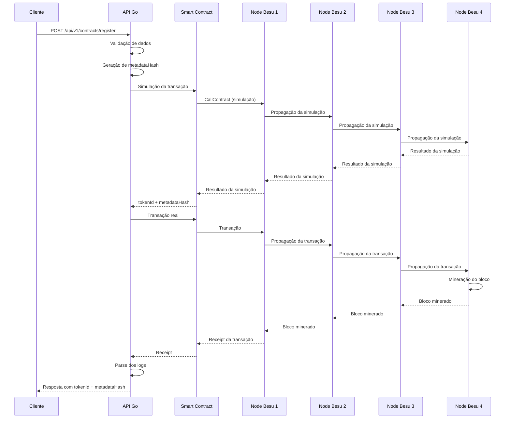

### 2. Detalhamento da Simulação

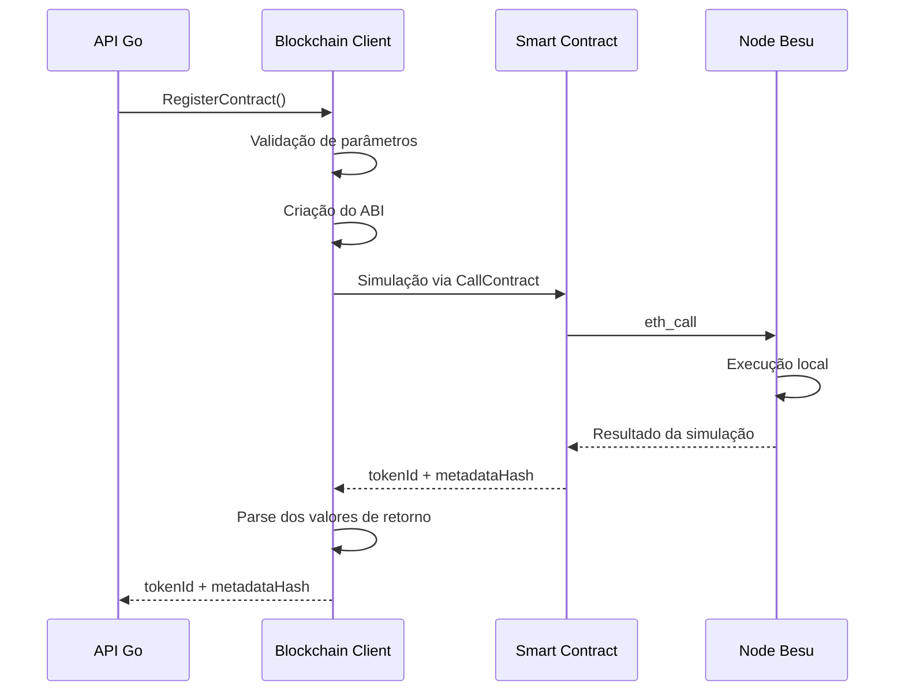

### 3. Detalhamento da Transação Real

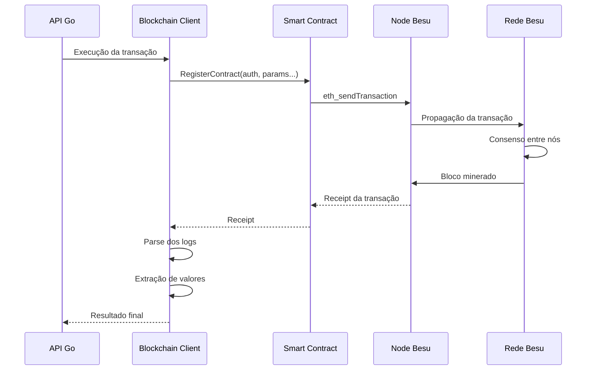

## 🔍 Consultas e Leitura de Dados

### 4. Consulta de Contrato por Hash

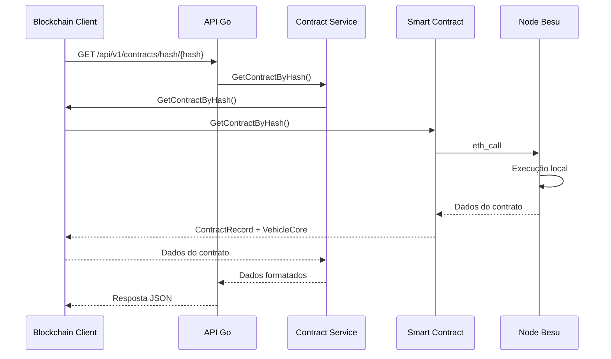

### 5. Verificação de Existência

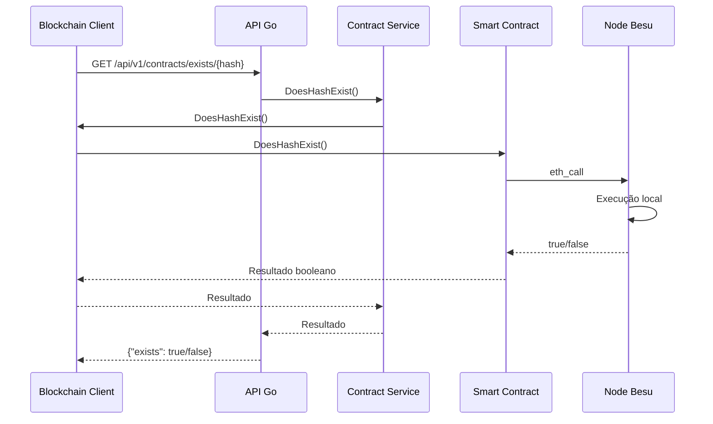

## 🔧 Operações de Atualização

### 6. Atualização de Status

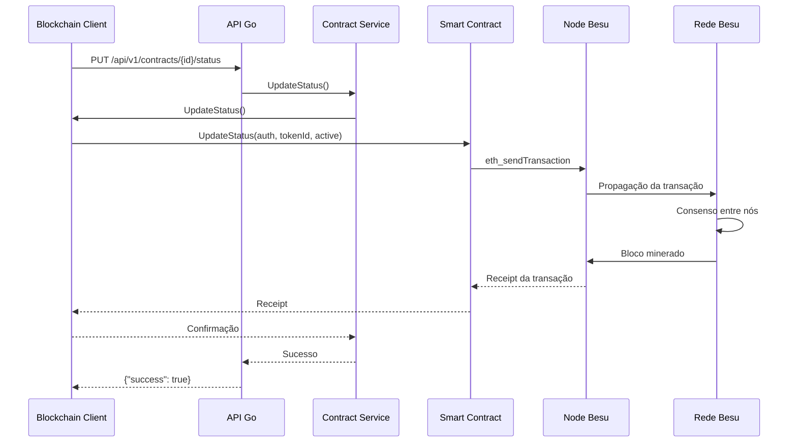

### 7. Atualização de Metadata

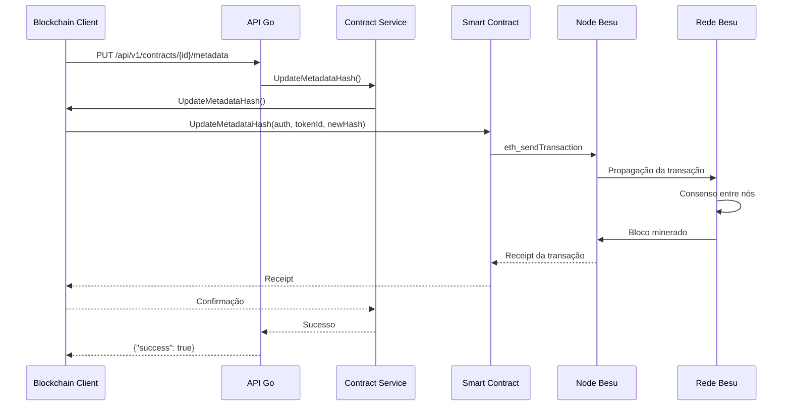

## 🏷️ Registro de Marcas e Modelos

### 8. Registro de Marca

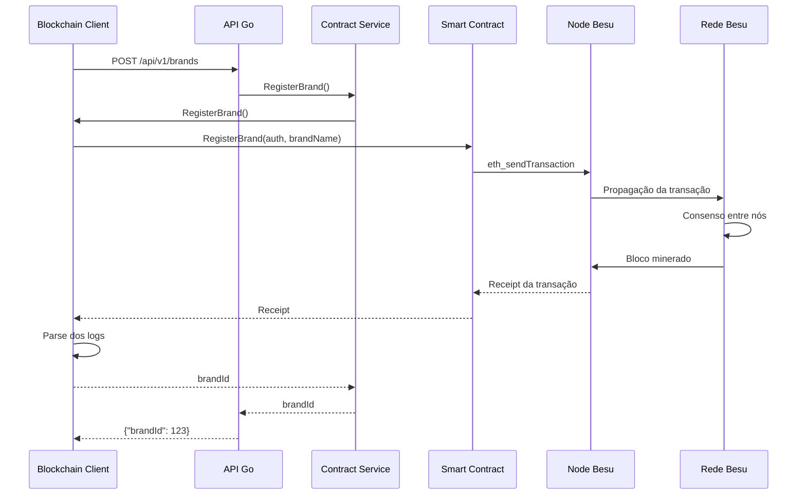

### 9. Registro de Modelo

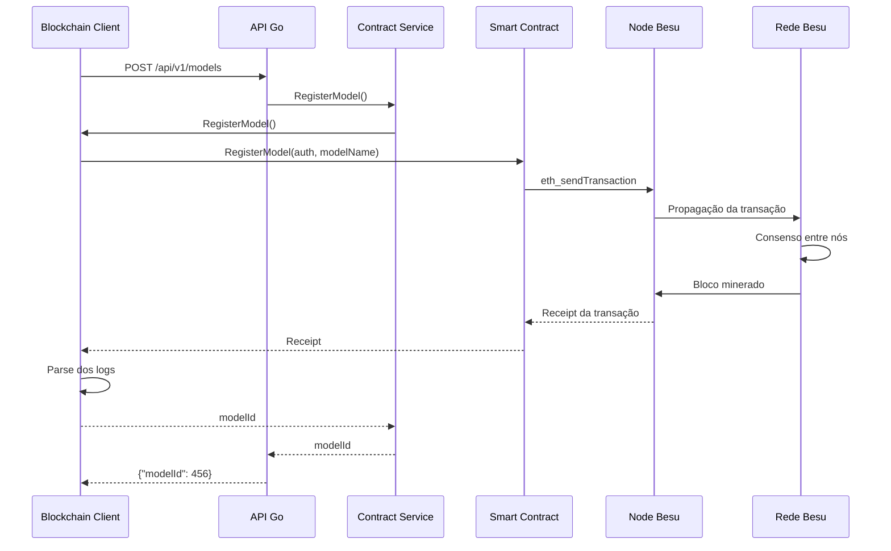

## 🌐 Rede Hyperledger Besu

### 10. Topologia da Rede

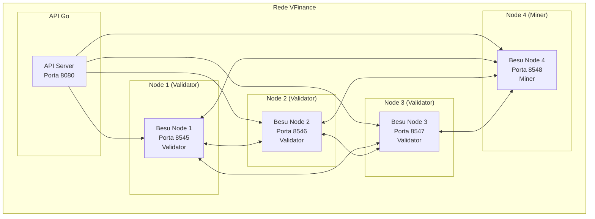

### 11. Consenso e Mineração

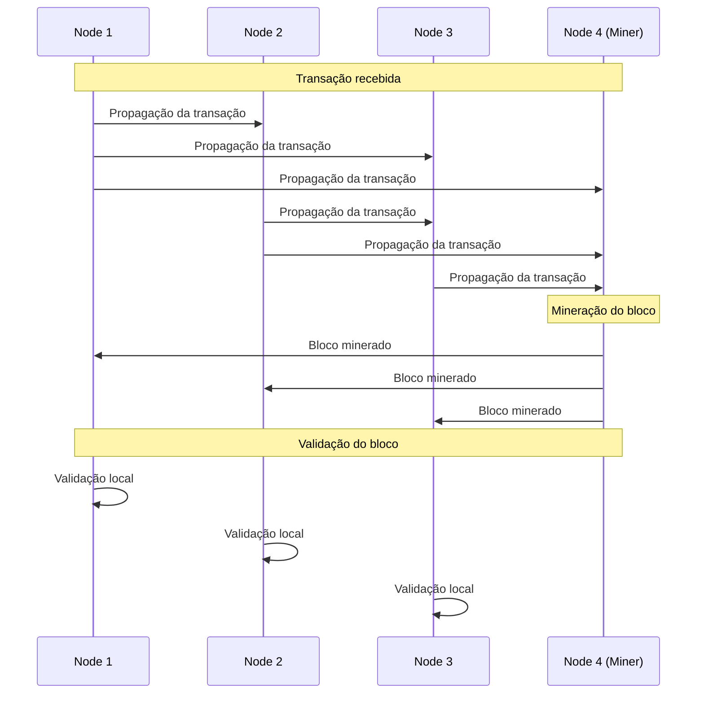

## 📊 Estrutura de Dados

### 12. Modelos de Dados

```mermaid
classDiagram
    class ContractRecord {
        +RegistryId [32]byte
        +ContractNumber [32]byte
        +ContractDate uint32
        +MetadataHash [32]byte
        +Timestamp uint32
        +RegisteredBy address
        +Active bool
    }

    class VehicleCore {
        +Chassis [32]byte
        +LicensePlate [32]byte
        +TotalValue *big.Int
        +BrandId uint64
        +ModelId uint64
    }

    class BlockchainContractRecord {
        +RegistryId string
        +ContractNumber string
        +ContractDate uint32
        +MetadataHash string
        +Timestamp uint32
        +RegisteredBy string
        +Active bool
    }

    class BlockchainVehicleCore {
        +Chassis string
        +LicensePlate string
        +TotalValue string
        +BrandId uint64
        +ModelId uint64
    }

    ContractRecord ||--|| VehicleCore
    BlockchainContractRecord ||--|| BlockchainVehicleCore
```

## 🔐 Autenticação e Autorização

### 13. Fluxo de Autenticação

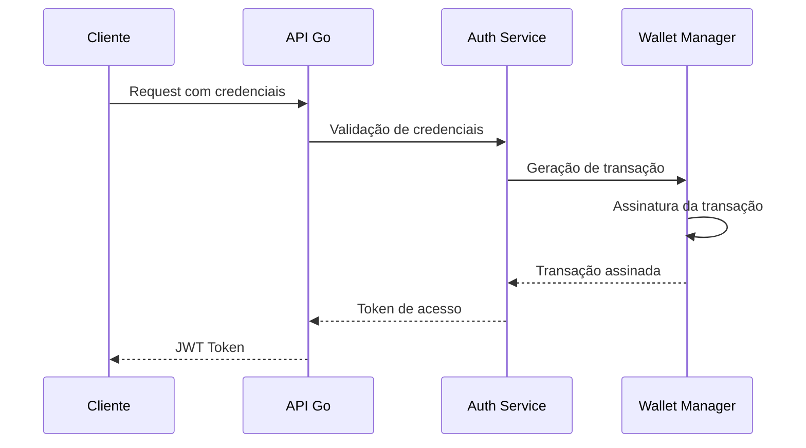

## 📝 Eventos da Blockchain

### 14. Eventos do Contrato

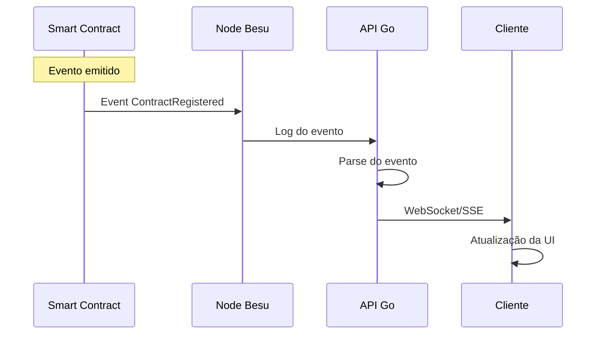

## 🚀 Deploy e Configuração

### 15. Processo de Deploy

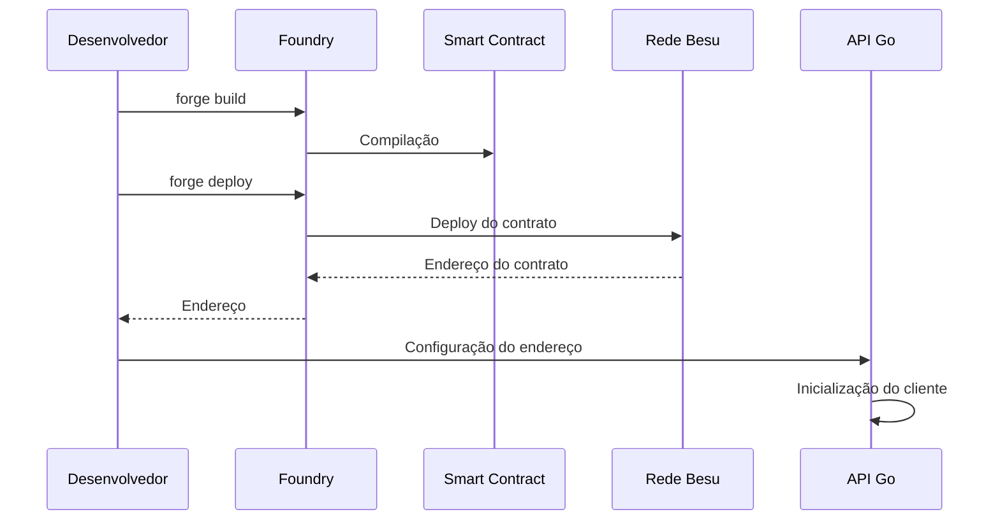

## 📋 Resumo dos Endpoints

### API Endpoints

| Método | Endpoint | Descrição |
|--------|----------|------------|
| POST | `/api/v1/contracts/register` | Registra novo contrato |
| GET | `/api/v1/contracts/hash/{hash}` | Busca contrato por hash |
| GET | `/api/v1/contracts/exists/{hash}` | Verifica existência |
| PUT | `/api/v1/contracts/{id}/status` | Atualiza status |
| PUT | `/api/v1/contracts/{id}/metadata` | Atualiza metadata |
| POST | `/api/v1/brands` | Registra marca |
| POST | `/api/v1/models` | Registra modelo |

### Smart Contract Functions

| Função | Tipo | Descrição |
|--------|------|-----------|
| `registerContract` | Write | Registra contrato |
| `getContractByHash` | View | Busca contrato |
| `doesHashExist` | View | Verifica existência |
| `updateStatus` | Write | Atualiza status |
| `updateMetadataHash` | Write | Atualiza metadata |
| `registerBrand` | Write | Registra marca |
| `registerModel` | Write | Registra modelo |

## 🔧 Configuração dos Nodes

### Node 1 (Validator)
```bash
besu --data-path=/data/node1 \
     --genesis-file=/config/genesis.json \
     --bootnodes=enode://... \
     --p2p-port=30303 \
     --rpc-http-port=8545 \
     --rpc-http-cors-origins="*" \
     --rpc-http-apis=ETH,NET,WEB3,DEBUG,ADMIN \
     --host-allowlist="*" \
     --miner-enabled=false
```

### Node 2 (Validator)
```bash
besu --data-path=/data/node2 \
     --genesis-file=/config/genesis.json \
     --bootnodes=enode://... \
     --p2p-port=30304 \
     --rpc-http-port=8546 \
     --rpc-http-cors-origins="*" \
     --rpc-http-apis=ETH,NET,WEB3,DEBUG,ADMIN \
     --host-allowlist="*" \
     --miner-enabled=false
```

### Node 3 (Validator)
```bash
besu --data-path=/data/node3 \
     --genesis-file=/config/genesis.json \
     --bootnodes=enode://... \
     --p2p-port=30305 \
     --rpc-http-port=8547 \
     --rpc-http-cors-origins="*" \
     --rpc-http-apis=ETH,NET,WEB3,DEBUG,ADMIN \
     --host-allowlist="*" \
     --miner-enabled=false
```

### Node 4 (Miner)
```bash
besu --data-path=/data/node4 \
     --genesis-file=/config/genesis.json \
     --bootnodes=enode://... \
     --p2p-port=30306 \
     --rpc-http-port=8548 \
     --rpc-http-cors-origins="*" \
     --rpc-http-apis=ETH,NET,WEB3,DEBUG,ADMIN \
     --host-allowlist="*" \
     --miner-enabled=true \
     --min-gas-price=0
```

## 📊 Métricas e Monitoramento

### Métricas dos Nodes
- **Block Height**: Altura atual da blockchain
- **Peer Count**: Número de nós conectados
- **Transaction Pool**: Transações pendentes
- **Gas Used**: Gás consumido por bloco
- **Block Time**: Tempo médio entre blocos

### Métricas da API
- **Request Rate**: Taxa de requisições por segundo
- **Response Time**: Tempo médio de resposta
- **Error Rate**: Taxa de erros
- **Active Connections**: Conexões ativas
- **Blockchain Calls**: Chamadas para a blockchain

---

## 📚 Referências

- [Hyperledger Besu Documentation](https://besu.hyperledger.org/)
- [Go Ethereum Documentation](https://geth.ethereum.org/docs/)
- [Solidity Documentation](https://docs.soliditylang.org/)
- [Foundry Book](https://book.getfoundry.sh/)


