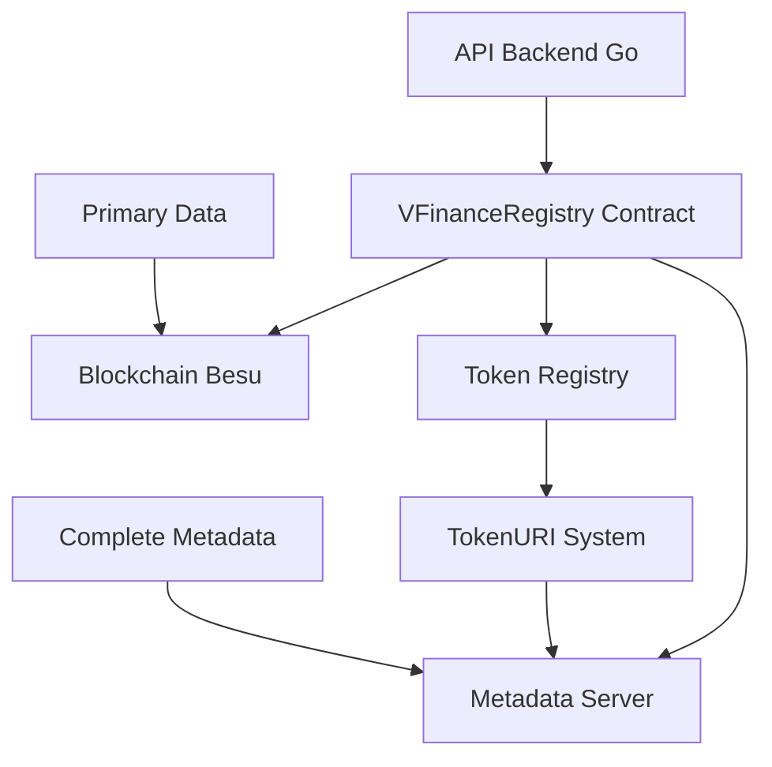

# 🚗 VFinance Registry - Contrato Inteligente

## 📋 Visão Geral

O **VFinanceRegistry** é um contrato inteligente otimizado para registro de contratos de financiamento automotivo na blockchain Hyperledger Besu. Utiliza a infraestrutura ERC721 UUPS (Universal Upgradeable Proxy Standard) como sistema de registro, **não como NFTs tradicionais**, conectando-se ao servidor de metadados para gestão completa dos dados.

### 🎯 **Características Principais**

- ✅ **UUPS Upgradeable**: Contrato atualizável de forma segura
- ✅ **Tokens Não-Transferíveis**: Registros imutáveis, não comercializáveis
- ✅ **Otimizado para Besu**: Estruturas empacotadas para economia de gas
- ✅ **Servidor de Metadados**: Integração via `tokenURI` com API externa
- ✅ **Rastreabilidade Completa**: Dados primários on-chain + metadados off-chain
- ✅ **100% Testado**: 35 testes com 93%+ de cobertura

---

## 🏗️ Arquitetura do Sistema



### **Fluxo de Dados**

1. **Registro**: API Go → Contrato → Blockchain (dados primários + hash)
2. **Token**: Contrato minta token não-transferível para si mesmo
3. **Metadados**: TokenURI aponta para servidor de metadados
4. **Consulta**: Frontend → API → Contrato/Servidor de metadados

---

## 📊 Estruturas de Dados

### **ContractRecord** (Dados principais on-chain)
```solidity
struct ContractRecord {
    bytes32 registryId;      // ID único do contrato (hash)
    bytes32 contractNumber;  // Número do contrato
    uint32 contractDate;     // Data do contrato (timestamp)
    bytes32 metadataHash;    // Hash SHA256 dos metadados
    uint32 timestamp;        // Timestamp de registro
    address registeredBy;    // Endereço que registrou
    bool active;             // Status ativo/inativo
}
```

### **VehicleCore** (Dados do veículo)
```solidity
struct VehicleCore {
    bytes32 chassis;         // Chassi do veículo
    bytes32 licensePlate;    // Placa do veículo
    uint128 totalValue;      // Valor total em wei
    uint64 brandId;          // ID da marca
    uint64 modelId;          // ID do modelo
}
```

---

## 🔧 Funções Principais

### **📝 Registro de Contratos**

#### `registerContract()`
```solidity
function registerContract(
    string calldata registryId,      // ID único do registro
    string calldata contractNumber,  // Número do contrato
    uint32 contractDate,            // Data do contrato
    string calldata chassis,        // Chassi do veículo
    string calldata licensePlate,   // Placa do veículo
    uint128 totalValue,             // Valor total
    string calldata brandName,      // Nome da marca
    string calldata modelName       // Nome do modelo
) external returns (uint256 tokenId, bytes32 metadataHash)
```

**Funcionalidade:**
- ✅ Registra novo contrato de financiamento
- ✅ Cria token não-transferível
- ✅ Gera hash dos metadados
- ✅ Registra marcas/modelos automaticamente
- ✅ Emite eventos para rastreabilidade

**Exemplo de Uso:**
```javascript
const result = await contract.registerContract(
    "VFIN-2024-001",           // registryId
    "FIN123456789",            // contractNumber
    1703980800,                // contractDate (timestamp)
    "9BWZZZ377VT004251",       // chassis
    "ABC1234",                 // licensePlate
    "50000000000000000000000", // totalValue (50k em wei)
    "TOYOTA",                  // brandName
    "COROLLA GLI 1.8"          // modelName
);
```

### **📖 Consultas de Dados**

#### `getContract()`
```solidity
function getContract(uint256 tokenId)
    external view returns (ContractRecord memory, VehicleCore memory)
```
- Retorna dados completos de um contrato pelo tokenId

#### `getContractByRegistryId()`
```solidity
function getContractByRegistryId(string calldata registryId)
    external view returns (ContractRecord memory, VehicleCore memory)
```
- Busca contrato pelo ID de registro

#### `getContractByChassis()`
```solidity
function getContractByChassis(string calldata chassis)
    external view returns (ContractRecord memory, VehicleCore memory)
```
- Busca contrato pelo chassi do veículo

#### `getActiveContracts()`
```solidity
function getActiveContracts(uint256 offset, uint256 limit)
    external view returns (uint256[] memory)
```
- Lista contratos ativos com paginação

### **🌐 Sistema de Metadados**

#### `tokenURI()`
```solidity
function tokenURI(uint256 tokenId) external view returns (string memory)
```
- Retorna URL do servidor de metadados
- Formato: `https://api.vfinance.com.br/api/metadata/0x{metadataHash}`

#### `getMetadataUrl()`
```solidity
function getMetadataUrl(bytes32 metadataHash) external view returns (string memory)
```
- Acesso direto à URL de metadados pelo hash

#### `getMetadataUrlByRegistryId()`
```solidity
function getMetadataUrlByRegistryId(string calldata registryId)
    external view returns (string memory)
```
- URL de metadados pelo ID de registro

### **🏷️ Gestão de Marcas e Modelos**

#### `registerBrand()` / `registerModel()`
```solidity
function registerBrand(string calldata brandName) external onlyOwner returns (uint64)
function registerModel(string calldata modelName) external onlyOwner returns (uint64)
```
- Registro manual de marcas e modelos

#### `getBrandName()` / `getModelName()`
```solidity
function getBrandName(uint64 brandId) external view returns (string memory)
function getModelName(uint64 modelId) external view returns (string memory)
```
- Consulta nomes por ID

### **✏️ Atualizações**

#### `updateMetadataHash()`
```solidity
function updateMetadataHash(uint256 tokenId, bytes32 newMetadataHash) external
```
- Atualiza hash de metadados (apenas API server)

#### `updateStatus()`
```solidity
function updateStatus(uint256 tokenId, bool active) external
```
- Atualiza status do contrato (apenas API server)

### **⚙️ Administração**

#### `updateServerConfig()`
```solidity
function updateServerConfig(string calldata newMetadataBaseUrl, address newApiServerAddress)
    external onlyOwner
```
- Atualiza configurações do servidor

#### `upgradeToAndCall()`
```solidity
function upgradeToAndCall(address newImplementation, bytes memory data) external onlyOwner
```
- Upgrade do contrato (UUPS)

---

## 🔒 Segurança e Controles

### **Modificadores de Acesso**

- `onlyOwner`: Apenas proprietário do contrato
- `onlyApiServer`: Apenas servidor API autorizado
- `validToken(tokenId)`: Valida existência do token

### **Validações**

- ✅ IDs de registro únicos
- ✅ Chassi único por contrato
- ✅ Strings não vazias obrigatórias
- ✅ Tokens não-transferíveis
- ✅ Proteção contra reentrância desnecessária removida (ambiente corporativo)

### **Eventos para Auditoria**

```solidity
event ContractRegistered(uint256 indexed tokenId, bytes32 indexed registryIdHash,
                        bytes32 indexed chassisHash, bytes32 metadataHash, uint256 timestamp);
event VehicleTracked(uint256 indexed tokenId, bytes32 chassis, bytes32 licensePlate,
                    uint128 totalValue, uint64 brandId, uint64 modelId);
event MetadataHashUpdated(uint256 indexed tokenId, bytes32 oldHash, bytes32 newHash);
event ContractStatusUpdated(uint256 indexed tokenId, bool active);
```

---

## 🚀 Como Registrar um Contrato

### **1. Via Backend API (Recomendado)**

```javascript
// POST /api/contracts/register
{
    "registryId": "VFIN-2024-001",
    "contractNumber": "FIN123456789",
    "contractDate": "2024-01-01T00:00:00Z",
    "vehicle": {
        "chassis": "9BWZZZ377VT004251",
        "licensePlate": "ABC1234",
        "brand": "TOYOTA",
        "model": "COROLLA GLI 1.8"
    },
    "financial": {
        "totalValue": "50000.00"
    }
}
```

### **2. Via Contrato Direto (Web3)**

```javascript
const Web3 = require('web3');
const web3 = new Web3('http://localhost:8545'); // Besu RPC

const contract = new web3.eth.Contract(ABI, CONTRACT_ADDRESS);

const result = await contract.methods.registerContract(
    "VFIN-2024-001",                    // registryId
    "FIN123456789",                     // contractNumber
    Math.floor(Date.now() / 1000),      // contractDate
    "9BWZZZ377VT004251",                // chassis
    "ABC1234",                          // licensePlate
    web3.utils.toWei("50000", "ether"), // totalValue
    "TOYOTA",                           // brandName
    "COROLLA GLI 1.8"                   // modelName
).send({ from: API_SERVER_ADDRESS });

console.log('TokenID:', result.tokenId);
console.log('Metadata Hash:', result.metadataHash);
```

### **3. Via Foundry Script**

```bash
# Deploy do contrato
forge script script/DeployVFinanceRegistryScript.s.sol --broadcast --rpc-url http://localhost:8545

# Registrar contrato via script personalizado
forge script RegisterContract.s.sol --broadcast --rpc-url http://localhost:8545
```

---

## 📋 Exemplo Completo de Registro

```solidity
// Exemplo de chamada completa
contract.registerContract(
    "VFIN-2024-12345",           // ID único do registro
    "FIN987654321",              // Número do contrato de financiamento
    1703980800,                  // 31 de dezembro de 2023
    "9BWZZZ377VT004251",         // Chassi VW Golf
    "BRA2E19",                   // Placa Mercosul
    75000000000000000000000,     // R$ 75.000 em wei
    "VOLKSWAGEN",                // Marca
    "GOLF TSI HIGHLINE 1.4"      // Modelo
);
```

**Resultado esperado:**
- ✅ Token ID gerado (ex: 1, 2, 3...)
- ✅ Hash de metadados criado
- ✅ Dados primários salvos on-chain
- ✅ URL de metadados: `https://api.vfinance.com.br/api/metadata/0x{hash}`
- ✅ Eventos emitidos para auditoria

---

## 🔗 Integração com Metadata Server

### **Estrutura da API de Metadados**

```bash
GET /api/metadata/0x{metadataHash}
```

**Resposta esperada:**
```json
{
    "registryId": "VFIN-2024-12345",
    "contractNumber": "FIN987654321",
    "contractDate": "2023-12-31T00:00:00Z",
    "vehicle": {
        "chassis": "9BWZZZ377VT004251",
        "licensePlate": "BRA2E19",
        "brand": "VOLKSWAGEN",
        "model": "GOLF TSI HIGHLINE 1.4",
        "year": 2023,
        "color": "Branco"
    },
    "financial": {
        "totalValue": "75000.00",
        "currency": "BRL",
        "installments": 60,
        "monthlyPayment": "1500.00"
    },
    "customer": {
        "name": "João Silva",
        "document": "***.***.***-**",
        "address": "Rua das Flores, 123"
    },
    "timestamps": {
        "registered": "2024-01-01T10:30:00Z",
        "lastUpdated": "2024-01-01T10:30:00Z"
    }
}
```

---

## 🧪 Testes

### **Executar Testes**

```bash
# Todos os testes
forge test

# Com detalhes
forge test -vv

# Cobertura
forge coverage --ir-minimum

# Teste específico
forge test --match-test testRegisterContract -vv
```

### **Cobertura Atual**
- **Linhas**: 93.71% (164/175)
- **Statements**: 91.37% (180/197)
- **Funções**: 91.43% (32/35)
- **Testes**: 35 passando

---

## 📦 Deploy

### **1. Configurar Environment**

```bash
# .env
PRIVATE_KEY=0x123...
RPC_URL=http://localhost:8545
CONTRACT_ADDRESS=0x...
```

### **2. Deploy na Rede Besu**

```bash
# Deploy inicial
forge script script/DeployVFinanceRegistryScript.s.sol \
    --broadcast \
    --rpc-url $RPC_URL \
    --private-key $PRIVATE_KEY

# Verificar deployment
forge verify-contract $CONTRACT_ADDRESS src/VFinanceRegistry.sol:VFinanceRegistry \
    --rpc-url $RPC_URL
```

### **3. Configurar Backend**

```go
// config.go
ContractAddress: "0x...",
RpcUrl: "http://localhost:8545",
PrivateKey: "0x...",
MetadataBaseUrl: "https://api.vfinance.com.br"
```

---

## ⚡ Otimizações para Besu

- **Packed Structs**: `uint32`, `uint64`, `bytes32` para economia de storage
- **Event Indexing**: Campos importantes marcados como `indexed`
- **Gas Efficiency**: Estruturas otimizadas para reduzir gas
- **Via IR**: Compilação otimizada para resolver "stack too deep"
- **Batch Operations**: Suporte a operações em lote

---

## 📚 Referências

- [OpenZeppelin UUPS](https://docs.openzeppelin.com/contracts/4.x/api/proxy#UUPSUpgradeable)
- [ERC721 Standard](https://eips.ethereum.org/EIPS/eip-721)
- [Hyperledger Besu](https://besu.hyperledger.org/)
- [Foundry Framework](https://book.getfoundry.sh/)

---

## 🤝 Contribuição

1. Fork o projeto
2. Crie sua feature branch (`git checkout -b feature/amazing-feature`)
3. Execute os testes (`forge test`)
4. Commit suas mudanças (`git commit -m 'Add amazing feature'`)
5. Push para a branch (`git push origin feature/amazing-feature`)
6. Abra um Pull Request

---

## 📄 Licença

Este projeto está licenciado sob a MIT License - veja o arquivo [LICENSE](LICENSE) para detalhes.

---

## 📞 Suporte

Para dúvidas ou suporte:
- **Email**: security@vfinance.com.br
- **Documentação**: [docs/ARQUITETURA_COMPLETA.md](../docs/ARQUITETURA_COMPLETA.md)
- **API Reference**: [docs/EXEMPLOS_API.md](../docs/EXEMPLOS_API.md)
